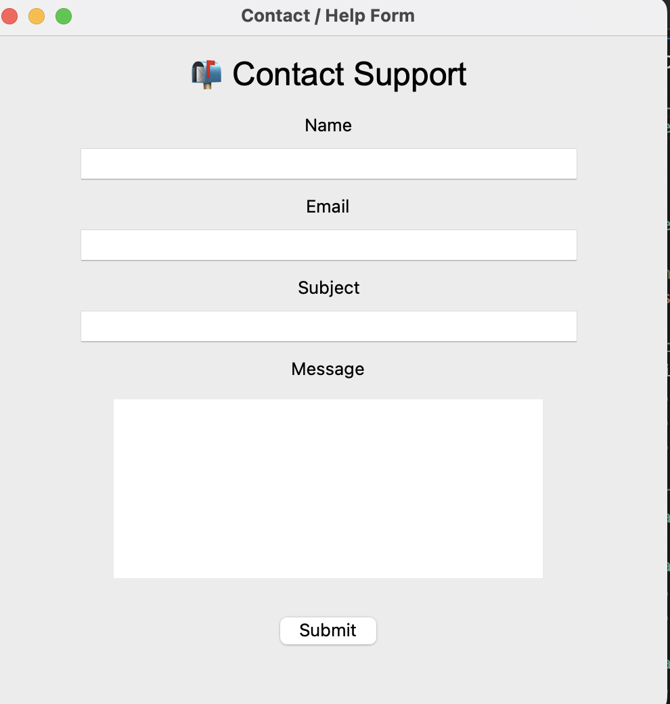
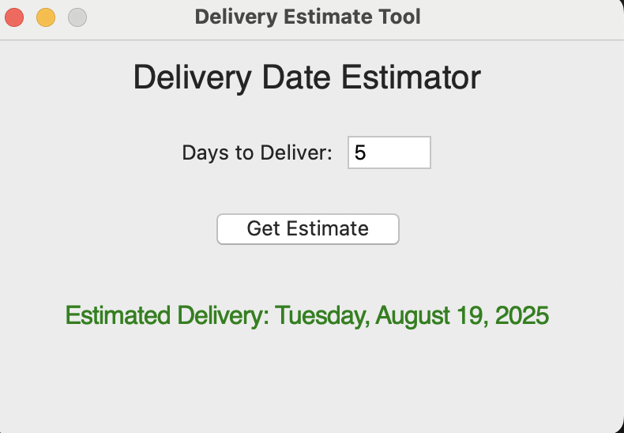
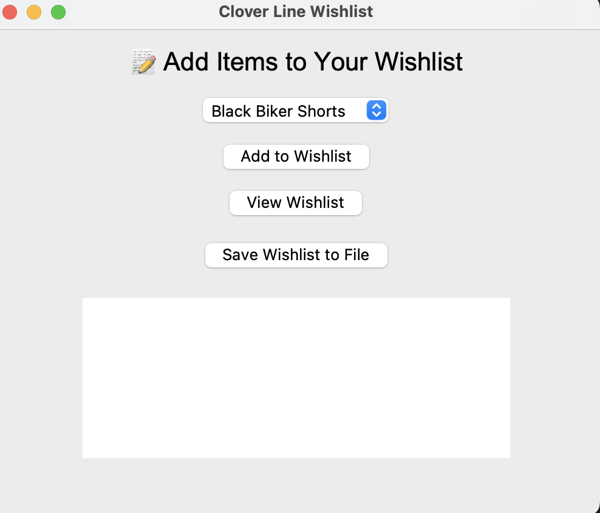
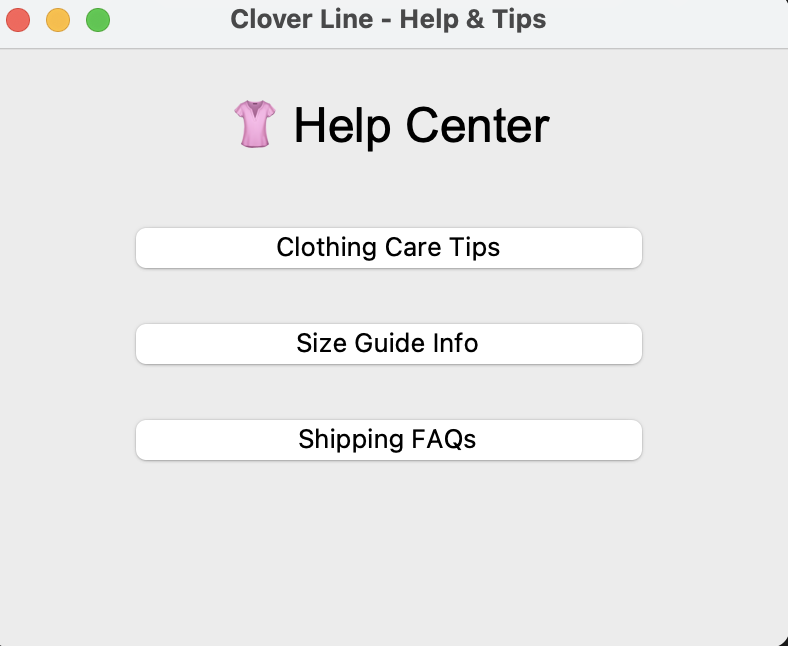

<head>
  
</head>

<!-- Header -->
<header>
  

    
    <h1>James Johnson</h1>
    
Full Stack Developer

    
Graduation Date: June 2025

  

</header>

<!-- About -->
<section id="about">
  <h2>About Me</h2>
  
  

    I am a passionate Full Stack Developer dedicated to creating seamless, user-friendly applications by building and integrating both front-end interfaces and back-end systems. I bring strong attributes to every project, including clear communication, accountability, active listening, and adaptability.
  

  <h3>Career Aspirations</h3>
  

    I am looking for a collaborative work environment where I can contribute to innovative projects as a Full Stack Developer. My ideal role involves working with modern technologies to build scalable applications that solve real-world problems. I thrive in teams that value creativity, continuous learning, and open communication. My goal is to join a company that encourages professional growth while making a positive impact through technology.
  

</section>

<!-- Skills -->
<section id="skills">
  <h2>Skills</h2>
  

    <h3>Frontend Development</h3>
    <ul>
      <li>Python Tkinter for creating responsive and user-friendly interfaces.</li>
    </ul>
    <h3>Version Control</h3>
    <ul>
      <li>Strong understanding of Git and GitHub for collaborative development and version tracking.</li>
    </ul>
    <h3>UI/UX Design</h3>
    <ul>
      <li>Adept at crafting intuitive layouts that enhance user experience across devices.</li>
    <ul>
      <li>Familiar with GitHub Pages and cloud-based deployment workflows.</li>
    </ul>
    <h3>Problem-Solving & Debugging</h3>
    <ul>
      <li>Proficient in identifying, troubleshooting, and resolving technical issues to ensure optimal performance.</li>
    </ul>
  

</section>

<!-- Projects -->
<section id="projects">
  <h2>Projects</h2>
  

    <h3>SmartFit Size Recommender</h3>
    
    
Python Tkinter app for personalized clothing size recommendations.

    
<strong>Tech:</strong> Python, Tkinter, CSV

    <a href="/Security-Architect/projects/smartfit.html" class="project-link">View Code</a>
  

  

    <h3>Contact Form System</h3>
    
    
Python Tkinter app for customer inquiries and feedback submission.

    
<strong>Tech:</strong> Python, Tkinter, CSV

    <a href="/Security-Architect/projects/contact-form.html" class="project-link">View Code</a>
  

  

    <h3>Delivery Tracker</h3>
    
    
Python Tkinter app for tracking order deliveries and status updates.

    
<strong>Tech:</strong> Python, Tkinter, CSV

    <a href="/Security-Architect/projects/delivery-tracker.html" class="project-link">View Code</a>
  

  

    <h3>Wishlist Application</h3>
    
    
Python Tkinter app allowing customers to save and manage their product wishlist.

    
<strong>Tech:</strong> Python, Tkinter, CSV

    <a href="/Security-Architect/projects/wishlist.html" class="project-link">View Code</a>
  

  

    <h3>Help Center & FAQs</h3>
    
    
Interactive Tkinter help center with frequently asked questions and search functionality.

    
<strong>Tech:</strong> Python, Tkinter, CSV

    <a href="/Security-Architect/projects/faqs.html" class="project-link">View Code</a>
  

</section>

<!-- Contact -->
<section id="contact">
  <h2>Contact</h2>
  

    
Email: <a href="mailto:1997Jamesjjohnson@gmail.com">1997Jamesjjohnson@gmail.com</a>

    
GitHub: <a href="https://github.com/therealjiggady" target="_blank">therealjiggady</a>

    
LinkedIn: <a href="https://www.linkedin.com/in/james-johnson-63b381367/" target="_blank">James Johnson</a>

  

</section>

<!-- Footer -->
<footer>
  
&copy; 2025 James Johnson. All rights reserved.

  
</footer>
