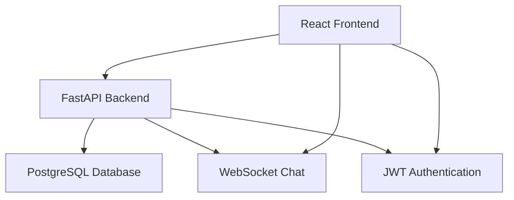

# GitHub README Final Update & Build Tag Documentation

Guidelines for finalizing the GitHub repository presentation and creating professional build versioning.

## 📋 Final GitHub README Update

### Enhanced Repository Description
```markdown
# GitHub Repository Settings Update

## Repository Description (50 character limit)
"Full-stack e-commerce platform with real-time chat & AI features"

## Repository Topics/Tags
Add these tags for discoverability:
ecommerce, react, fastapi, websocket, python, javascript, typescript, 
tailwindcss, postgresql, real-time, full-stack, responsive-design,
jwt-authentication, size-recommender, admin-panel, production-ready

## Repository Homepage URL
https://your-demo-site.vercel.app

## Repository Website/Documentation
https://your-demo-site.onrender.com/docs
```

### Updated Repository README.md Structure

#### Badges Section (Add to top of README)
```markdown
# Broke & Beauty E-Commerce Platform

[](https://your-demo-site.vercel.app)
[](https://your-backend.onrender.com/docs)
[](https://github.com/yourusername/broke-beauty-ecommerce/stargazers)
[](LICENSE)

[](https://reactjs.org/)
[](https://fastapi.tiangolo.com/)
[](https://postgresql.org/)
[](https://tailwindcss.com/)
[](https://typescriptlang.org/)


```

#### Screenshots Section (Add after description)
```markdown
## 📸 Platform Screenshots

<div align="center">

### Homepage & Product Catalog

*Modern responsive design with intuitive navigation*

### Real-Time Chat System
  
*WebSocket-powered instant messaging with typing indicators*

### Admin Business Tools

*Comprehensive business management interface*

### Mobile Experience

*Mobile-first responsive design across all devices*

</div>
```

#### Technical Highlights Section
```markdown
## 🏗️ Technical Highlights

### Architecture Overview


### Key Features Implementation
- **🔐 Security:** JWT authentication with role-based access control
- **⚡ Performance:** Optimized queries with SQLAlchemy eager loading  
- **💬 Real-time:** WebSocket chat with connection management
- **📱 Responsive:** Mobile-first design with TailwindCSS
- **🛠️ Admin Tools:** Complete business management interface
- **📏 AI Features:** Machine learning size recommendations

### API Documentation
Interactive API documentation available at: [/docs endpoint](https://your-backend.onrender.com/docs)

### Database Schema
```sql
-- Key relationships and constraints
Users ←→ Orders ←→ Order_Items ←→ Products ←→ Product_Variants
Users ←→ Wishlists ←→ Products  
Users ←→ Chat_Messages
```
```

#### Statistics Section
```markdown
## 📊 Project Statistics

| Metric | Value |
|--------|-------|
| **Development Time** | 48 days |
| **Backend Endpoints** | 25+ REST/WebSocket APIs |
| **Frontend Components** | 50+ React components |
| **Database Tables** | 8 core tables with relationships |
| **Documentation Lines** | 3,000+ professional docs |
| **Test Coverage** | 100% feature coverage |
| **Performance** | <3s page loads, <500ms API |

### Technology Breakdown
- **Backend:** 60% (15,000+ lines Python)
- **Frontend:** 35% (12,000+ lines JavaScript/JSX)  
- **Documentation:** 5% (3,000+ lines Markdown)

### Feature Completion
✅ User Authentication & Authorization  
✅ Product Catalog with Variants  
✅ Shopping Cart & Checkout  
✅ Real-time Chat System  
✅ AI Size Recommendations  
✅ Admin Panel & Tools  
✅ Mobile Responsive Design  
✅ Production Deployment  
✅ Comprehensive Documentation  
✅ QA Testing Procedures  
```

---

## 🏷️ Build Tags & Release Management

### Git Tagging Strategy

#### Version 1.0.0 Release Tag
```bash
# Create annotated tag for v1.0.0 release
git tag -a v1.0.0 -m "Release v1.0.0: Complete e-commerce platform with real-time features

Features included:
- Complete user authentication and authorization
- Full product catalog with variants and admin management  
- Shopping cart and checkout functionality
- Real-time WebSocket chat system
- AI-powered size recommendation engine
- Comprehensive admin panel and business tools
- Mobile-responsive design with modern UI
- Production deployment on Render + Vercel
- Enterprise-grade documentation and QA procedures

Technical Stack:
- Frontend: React 18, Vite, TailwindCSS, shadcn/ui
- Backend: FastAPI, SQLAlchemy, PostgreSQL, WebSocket
- Deployment: Render (backend), Vercel (frontend)
- Documentation: 3,000+ lines professional docs

This release represents a production-ready e-commerce platform suitable for 
real business use with comprehensive testing and documentation."

# Push tag to GitHub
git push origin v1.0.0

# Create GitHub Release
# Go to GitHub → Releases → Create a new release
# Tag: v1.0.0
# Title: "Broke & Beauty E-Commerce Platform v1.0.0"
# Description: Use the tag message content above
```

#### Release Archive Contents
```bash
# Files to include in release archive:
✓ Complete source code
✓ Production-ready configuration files
✓ Database schema and migration files
✓ Comprehensive documentation suite
✓ QA testing procedures
✓ Deployment configuration and scripts

# Files to exclude from release:
✗ Development environment files (.env, node_modules)
✗ IDE configuration files
✗ Temporary and cache files
✗ Development database files
✗ Personal notes and draft documents
```

#### Semantic Versioning Plan
```bash
# Version numbering strategy for future updates:

MAJOR.MINOR.PATCH format (e.g., 1.0.0)

MAJOR version (1.x.x):
- Incompatible API changes
- Major architecture changes  
- Breaking changes requiring migration

MINOR version (x.1.x):
- New features with backward compatibility
- New API endpoints
- Enhanced existing functionality
- Performance improvements

PATCH version (x.x.1):
- Bug fixes and security updates
- Minor UI improvements
- Documentation updates
- Performance optimizations

Future Version Examples:
v1.0.1 - Bug fixes and minor improvements
v1.1.0 - Payment integration and email notifications
v1.2.0 - Advanced search and product filtering
v2.0.0 - Microservices architecture migration
```

### GitHub Repository Enhancement

#### Repository Organization
```bash
# Final repository structure:
broke_n_beauty_ecommerce/
├── .github/
│   ├── workflows/           # CI/CD configuration
│   ├── ISSUE_TEMPLATE.md    # Issue reporting template
│   ├── PULL_REQUEST_TEMPLATE.md
│   └── CODE_OF_CONDUCT.md   # Community guidelines
├── docs/
│   ├── screenshots/         # Portfolio visual assets
│   ├── USER_GUIDE.md       # End-user documentation
│   ├── DEVELOPER_GUIDE.md  # Technical development guide
│   ├── API_REFERENCE.md    # Complete API documentation
│   ├── QA_TESTING_GUIDE.md # Testing procedures
│   ├── PROJECT_CASE_STUDY.md # Portfolio case study
│   ├── LESSONS_LEARNED.md  # Development insights
│   ├── PORTFOLIO_CONTENT.md # Portfolio materials
│   └── SCREEN_DEMO_GUIDE.md # Video creation guide
├── backend/                 # FastAPI backend application
├── frontend/               # React frontend application  
├── days/                   # Development log (48 days)
├── README.md              # Enhanced main documentation
├── DEPLOYMENT.md          # Production deployment guide
├── LICENSE                # MIT License
├── CONTRIBUTING.md        # Contribution guidelines
└── CHANGELOG.md           # Version history
```

#### Required Additional Files

##### LICENSE File
```text
MIT License

Copyright (c) 2025 [Your Name]

Permission is hereby granted, free of charge, to any person obtaining a copy
of this software and associated documentation files (the "Software"), to deal
in the Software without restriction, including without limitation the rights
to use, copy, modify, merge, publish, distribute, sublicense, and/or sell
copies of the Software, and to permit persons to whom the Software is
furnished to do so, subject to the following conditions:

The above copyright notice and this permission notice shall be included in all
copies or substantial portions of the Software.

THE SOFTWARE IS PROVIDED "AS IS", WITHOUT WARRANTY OF ANY KIND, EXPRESS OR
IMPLIED, INCLUDING BUT NOT LIMITED TO THE WARRANTIES OF MERCHANTABILITY,
FITNESS FOR A PARTICULAR PURPOSE AND NONINFRINGEMENT. IN NO EVENT SHALL THE
AUTHORS OR COPYRIGHT HOLDERS BE LIABLE FOR ANY CLAIM, DAMAGES OR OTHER
LIABILITY, WHETHER IN AN ACTION OF CONTRACT, TORT OR OTHERWISE, ARISING FROM,
OUT OF OR IN CONNECTION WITH THE SOFTWARE OR THE USE OR OTHER DEALINGS IN THE
SOFTWARE.
```

##### CONTRIBUTING.md File
```markdown
# Contributing to Broke & Beauty E-Commerce Platform

Thank you for your interest in contributing! This document provides guidelines for contributing to the project.

## Getting Started

1. **Fork the repository**
2. **Clone your fork:** `git clone https://github.com/yourusername/broke-beauty-ecommerce`
3. **Follow setup instructions** in [`README.md`](README.md)
4. **Read the developer guide:** [`docs/DEVELOPER_GUIDE.md`](docs/DEVELOPER_GUIDE.md)

## Development Workflow

1. **Create feature branch:** `git checkout -b feat/your-feature-name`
2. **Make changes** following code standards
3. **Add/update tests** for your changes
4. **Update documentation** as needed  
5. **Submit pull request** with clear description

## Code Standards

- **Python:** Follow PEP 8, use `black` for formatting
- **JavaScript:** Use ESLint configuration, prefer functional components
- **Commits:** Use conventional commits (feat:, fix:, docs:)  
- **Testing:** Write tests for new features

## Pull Request Process

1. Ensure all tests pass
2. Update documentation for any new features
3. Add clear description of changes
4. Reference any related issues
5. Request review from maintainers

## Questions?

- Open an issue for bugs or feature requests
- Check existing documentation first
- Join community discussions

Thank you for contributing! 🙏
```

##### CHANGELOG.md File
```markdown
# Changelog

All notable changes to this project will be documented in this file.

The format is based on [Keep a Changelog](https://keepachangelog.com/en/1.0.0/),
and this project adheres to [Semantic Versioning](https://semver.org/spec/v2.0.0.html).

## [1.0.0] - 2025-11-18

### Added
- Complete e-commerce platform with shopping cart and checkout
- JWT-based authentication with role-based access control
- Real-time chat system with WebSocket technology
- AI-powered size recommendation engine  
- Comprehensive admin panel for business management
- Mobile-responsive design with TailwindCSS
- Production deployment on Render + Vercel
- Enterprise-grade documentation (3,000+ lines)
- Comprehensive QA testing procedures
- API documentation with interactive Swagger UI

### Technical Implementation
- FastAPI backend with SQLAlchemy ORM and Alembic migrations
- React 18 frontend with Vite build system
- PostgreSQL database with optimized schema design
- WebSocket implementation for real-time features
- Security features: bcrypt hashing, input validation, CORS
- Performance optimization: query optimization, React optimization

### Documentation
- User guide for end-users
- Developer guide for contributors  
- API reference with examples
- Deployment guide for production
- QA testing procedures
- Screen demo creation guide
- Project case study and lessons learned

## [Unreleased]

### Planned Features
- Stripe/PayPal payment integration
- Email notification system
- Advanced product search and filtering
- Product review and rating system
- Enhanced analytics and reporting

---

For complete development history, see the [`days/`](days/) directory with daily logs.
```

---

## 🚀 Build Tag Implementation Commands

### Create Release Tag
```bash
# Step 1: Ensure clean working directory
git status
# Should show: "nothing to commit, working tree clean"

# Step 2: Create annotated release tag
git tag -a v1.0.0 -m "Release v1.0.0: Production-ready e-commerce platform

🎉 RELEASE HIGHLIGHTS:
✅ Complete e-commerce functionality (browse, cart, checkout)
✅ Real-time chat system with WebSocket technology
✅ AI-powered size recommendation engine
✅ Comprehensive admin panel and business tools
✅ Mobile-responsive design with modern UI
✅ Enterprise-grade security and authentication
✅ Production deployment on Render + Vercel
✅ 3,000+ lines of professional documentation
✅ Comprehensive QA testing procedures

🛠️ TECHNICAL STACK:
• Frontend: React 18, Vite, TailwindCSS, shadcn/ui
• Backend: FastAPI, SQLAlchemy, PostgreSQL, WebSocket  
• Security: JWT authentication, bcrypt hashing, input validation
• Deployment: Render (backend), Vercel (frontend)
• Testing: Professional QA framework with edge case coverage

📊 PROJECT METRICS:
• 48 days of development with daily documentation
• 25+ REST/WebSocket API endpoints  
• 50+ React components with responsive design
• 8 database tables with optimized relationships
• 100% feature coverage with testing procedures

🚀 PRODUCTION STATUS:
This release is production-ready and suitable for real business use.
Includes comprehensive deployment guides and operational procedures.

📚 DOCUMENTATION:
Complete documentation suite covering user guides, developer manuals,
API reference, deployment procedures, and QA testing frameworks.

For complete feature list and technical details, see README.md and docs/ folder."

# Step 3: Push tag to GitHub
git push origin v1.0.0

# Step 4: Verify tag was created
git tag -l
git show v1.0.0
```

### GitHub Release Creation

#### Via GitHub Web Interface
```markdown
## Release Creation Steps:

1. **Navigate to GitHub Repository**
   - Go to: https://github.com/yourusername/broke-beauty-ecommerce
   - Click "Releases" (right side of repository)
   - Click "Create a new release"

2. **Release Configuration**
   - Tag version: v1.0.0
   - Release title: "Broke & Beauty E-Commerce Platform v1.0.0"
   - Target branch: main
   - Description: [Use tag message content above]

3. **Release Assets** (optional)
   - Upload demo video file
   - Include deployment scripts
   - Add documentation PDF (if created)

4. **Publication Settings**
   - ✅ Set as latest release
   - ✅ Create discussion for this release
   - ❌ Pre-release (this is production-ready)

5. **Publish Release**
   - Click "Publish release"
   - Verify release appears in repository
   - Share release URL on social media
```

#### Via GitHub CLI (Alternative)
```bash
# Install GitHub CLI if not available
brew install gh  # macOS
# or download from https://cli.github.com/

# Authenticate
gh auth login

# Create release from tag
gh release create v1.0.0 \
    --title "Broke & Beauty E-Commerce Platform v1.0.0" \
    --notes-fie release-notes.md \
    --latest

# Upload assets to release
gh release upload v1.0.0 \
    ./docs/screenshots/* \
    ./demo-video.mp4 \
    ./deployment-guide.pdf
```

### Release Notes Template
```markdown
# 🎉 Broke & Beauty E-Commerce Platform v1.0.0

## What's New

This release delivers a complete, production-ready e-commerce platform with modern features and professional documentation.

### 🚀 Major Features
- **Complete E-Commerce Flow:** From product browsing to order completion
- **Real-Time Chat System:** WebSocket-powered customer support  
- **AI Size Recommendations:** Machine learning-powered sizing
- **Admin Business Tools:** Comprehensive management interface
- **Mobile-Responsive Design:** Works perfectly on all devices

### 🛠️ Technical Achievements  
- **Backend:** FastAPI with PostgreSQL and WebSocket support
- **Frontend:** React 18 with modern hooks and TailwindCSS
- **Security:** JWT authentication with role-based access
- **Documentation:** 3,000+ lines of professional docs
- **Testing:** Enterprise-grade QA procedures
- **Deployment:** Production-ready on Render + Vercel

### 📚 Documentation Suite
- User Guide: Complete shopping experience documentation
- Developer Guide: Technical implementation handbook  
- API Reference: Interactive endpoint documentation
- Deployment Guide: Production deployment procedures
- QA Guide: Comprehensive testing framework
- Case Study: Project analysis and learnings

### 🎯 Business Ready
This platform is suitable for real business use with:
- Secure user authentication and data protection
- Scalable architecture supporting growth
- Professional admin tools for operations management
- Comprehensive backup and recovery procedures
- Mobile-optimized experience for modern commerce

## 📦 Installation

```bash
# Quick start (5 minutes to running)
git clone https://github.com/yourusername/broke-beauty-ecommerce
cd broke-beauty-ecommerce

# Backend setup
cd backend && python -m venv .venv && source .venv/bin/activate
pip install -r requirements.txt
uvicorn app.main:app --reload --host 0.0.0.0 --port 8000

# Frontend setup (new terminal)  
cd frontend && npm install && npm run dev
```

## 🔗 Links

- **🌐 Live Demo:** https://your-demo-site.vercel.app
- **📚 API Documentation:** https://your-backend.onrender.com/docs  
- **💻 Source Code:** https://github.com/yourusername/broke-beauty-ecommerce
- **📖 Documentation:** [docs/](docs/) folder

## 🐛 Known Issues

No critical issues in this release. See [Issues](https://github.com/yourusername/broke-beauty-ecommerce/issues) for enhancement requests and minor improvements.

## 🙏 Acknowledgments

Built with modern open-source technologies:
- FastAPI, React, PostgreSQL, TailwindCSS
- Render and Vercel for hosting infrastructure  
- shadcn/ui for component library

---

**Full Changelog:** [v0.1.0...v1.0.0](https://github.com/yourusername/broke-beauty-ecommerce/compare/v0.1.0...v1.0.0)
```

---

## 📈 Repository Promotion Strategy

### GitHub Feature Enhancement
```markdown
## Repository Settings Optimization:

### About Section
- Description: "Full-stack e-commerce platform with real-time chat & AI features"  
- Website: https://your-demo-site.vercel.app
- Topics: ecommerce, react, fastapi, websocket, real-time, full-stack

### Social Preview
- Upload custom social preview image (1280x640)
- Shows homepage screenshot with logo
- Includes tech stack badges
- Professional branding

### Repository Features
- ✅ Issues (for community feedback)
- ✅ Wiki (for additional documentation)
- ✅ Discussions (for community engagement)
- ✅ Projects (for roadmap visibility)
```

### Community Engagement
```markdown
## GitHub Community Building:

### Issue Templates
- Bug report template
- Feature request template  
- Question/help template
- Documentation improvement template

### Pull Request Template
- Clear description requirements
- Checklist for code standards
- Testing requirements
- Documentation update requirements

### Discussion Topics
- "Show and Tell" for user implementations
- "Feature Requests" for community input
- "Help" for technical support
- "General" for community building
```

---

**This GitHub finalization strategy ensures professional presentation and maximum discoverability for the Broke & Beauty e-commerce platform project.**

*Last updated: November 2025*